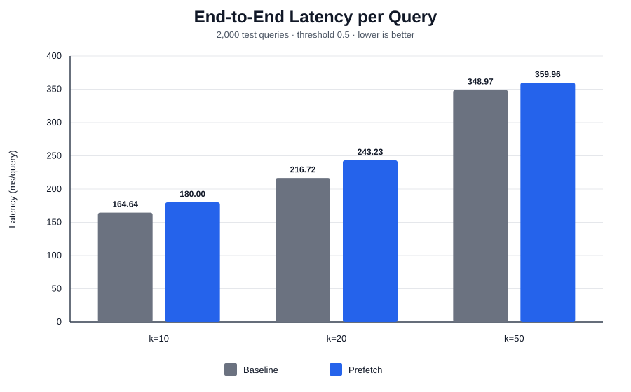

# Offline prefetch benchmark

The chart uses `elapsed_seconds / 2,000` and starts the y-axis at zero.

- Test queries: 2,000 per run (embedded HDF5 test split)
- Threshold: 0.5
- Raw payload: 512 KiB per node
- Async I/O workers: 4
- Cache control: `POSIX_FADV_DONTNEED` advised before every mmap
- Scope: offline inference and final top-k data-ready wait; live Faiss HNSW search is not included

## Measurements

| k | Prefetch | Total elapsed (s) | Query wait mean (us) | p95 (us) | p99 (us) | Async reads | Demand reads | Total read (GiB) | Wasted I/O ratio | TP delay |
|---:|:---:|---:|---:|---:|---:|---:|---:|---:|---:|---:|
| 10 | off | 329.287 | 53690.473 | 82684.625 | 84321.323 | 0 | 20000 | 9.766 | 0.233650 | 1.037750 |
| 10 | on | 360.009 | 79.837 | 104.744 | 121.081 | 24673 | 0 | 12.047 | 0.233650 | 1.037750 |
| 20 | off | 433.439 | 77108.941 | 154692.064 | 166392.105 | 0 | 40000 | 19.531 | 0.178275 | 1.062550 |
| 20 | on | 486.468 | 131.759 | 146.827 | 164.587 | 47131 | 0 | 23.013 | 0.178275 | 1.062550 |
| 50 | off | 697.943 | 106995.614 | 334017.019 | 409234.172 | 0 | 100000 | 48.828 | 0.117220 | 1.320940 |
| 50 | on | 719.915 | 218.342 | 241.606 | 296.859 | 111722 | 0 | 54.552 | 0.117220 | 1.320940 |

## On vs. off

Positive query-wait reduction means prefetch reduced final data waiting. Positive elapsed change means the prefetch-on run took longer overall.

| k | Total elapsed change (%) | Query wait reduction (%) |
|---:|---:|---:|
| 10 | 9.330 | 99.851 |
| 20 | 12.234 | 99.829 |
| 50 | 3.148 | 99.796 |

## Interpretation caveat

`POSIX_FADV_DONTNEED` is a per-file eviction hint, not a kernel guarantee. The timings can still contain page-cache hits. For stronger evidence, repeat the complete experiment several times and report variability.
